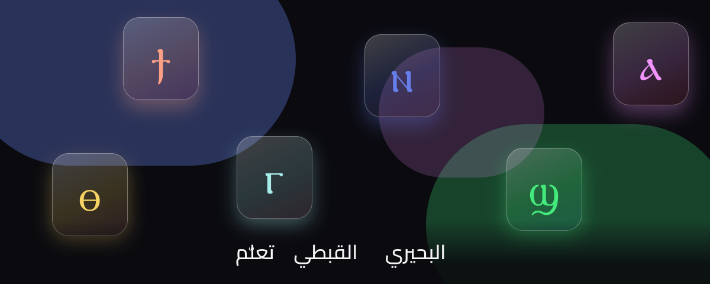

<div align="center">

<a href="https://learn-coptic.vercel.app">
  
</a>

# تعلّم القبطي البحيري

**الحروف اللي بتسمعها في القداس — مكتوبة يونيكود، بالعربي، على موبايلك.**

<a href="https://learn-coptic.vercel.app"></a>


مجاناً · من غير حساب · من غير تحميل · تقدّمك على الموبايل

افتح [الموقع](https://learn-coptic.vercel.app) — الحروف بتطفو في زجاج، وبتضيء لما تمرّ عليها.

</div>

---

Most Coptic apps teach **Sahidic**, or they teach in English. This one is
**Bohairic** — the dialect of the Coptic Orthodox Church today — and it
starts in Arabic, the way a Sunday-school teacher talks.

تنسخ الحرف وتحطه في واتساب، في درس، في أي حتة. اللي بتشوفه Ⲁ، مش
حرف لاتيني لابس فونت.

## ليه هنا

| | إيه اللي موجود |
|---|---|
| **٣٢ حرف** | سبع مجموعات بالألوان، من الحروف اللي شبه الإنجليزي للحروف اللي لأ |
| **قواعد النطق** | على الحروف اللي محتاجاها — قبل Ⲉ Ⲓ Ⲏ، مش جدار نحو |
| **١٤٧ كلمة** | قاموس، أسماء، وتمارين قراءة. التمرين عمره ما يتلبس بدلة قاموس |
| **يونيكود** | تنسخه. وضع المخطوطات (أثناسيوس) اختياري — الافتراضي يونيكود |

Phone-first. Dark by default. يشتغل في المتصفح اللي عندك.

## لمين

شماس بيتعلّم الحروف. مدرّس باعت لينك في جروب الكنيسة. حد كبر وهو
بيسمع بحيري وعايز يقرأ.

English is a supporting line, not a second site.

## Run it locally

```bash
npm install
npm run validate
npm run dev
```

`npm run validate` runs on every build. Invalid data cannot ship.

## How the content works

HTML is never the database. Everything learners see comes from JSON, checked
by Zod before the site builds:

| File | What it holds |
|---|---|
| `src/data/json/letters.json` | 32 letters, groups, pronunciation rules |
| `src/data/json/words.json` | lexicon / drill / name |
| `src/data/json/prayers.json` | prayers with line timings (recording comes later) |
| `src/data/json/curriculum.json` | levels → lessons |

## Next

Audio for every letter. A small quiz that remembers you. Then prayers with
the line highlighted as it’s sung.

## Stack

Next.js App Router · TypeScript · Tailwind · Zod · Vercel.
Fonts are self-hosted: GNU FreeSerif, Noto Sans Coptic, Cairo, optional
Athanasius Plain.

## Licence

Code MIT. Lesson text [CC BY-SA 4.0](https://creativecommons.org/licenses/by-sa/4.0/).
FreeSerif is GPL-3.0-or-later with Font-exception-2.0 — embedding it does not
put the app under the GPL. Details: [`docs/security.md`](docs/security.md).
